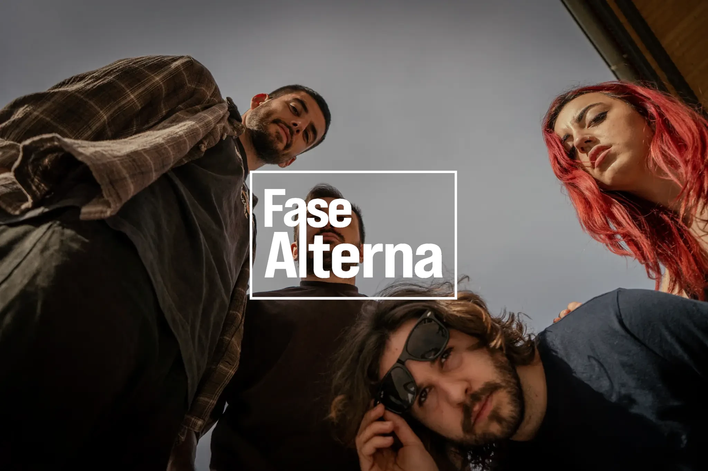

<a name="readme-top"></a>

<div align="center">

[![Contributors][contributors-shield]][contributors-url]
[![Forks][forks-shield]][forks-url]
[![Stargazers][stars-shield]][stars-url]
[![Issues][issues-shield]][issues-url]

<a href="https://fasealterna.es" target="_blank" rel="noopener noreferrer">
  
</a>

## Web oficial de Fase Alterna

**Fase Alterna** es una banda de rock alternativo que combina energía en vivo con una producción cuidada en estudio. Aquí podrás encontrar toda la información oficial sobre lanzamientos, conciertos y novedades.
[Reportar error](https://github.com/sierrapablo/fasealterna-web/issues) · [Sugerir mejora](https://github.com/sierrapablo/fasealterna-web/issues)

</div>

<details>
<summary>Tabla de contenidos</summary>

- [Web oficial de Fase Alterna](#web-oficial-de-fase-alterna)
- [Características principales](#características-principales)
- [Para empezar](#para-empezar)
  - [Prerequisitos](#prerequisitos)
  - [Instalación](#instalación)
- [Contribuir al proyecto](#contribuir-al-proyecto)
- [🛠️ Stack](#️-stack)
- [✨ Futuras implementaciones](#-futuras-implementaciones)
  - [Reproductor de vídeos personalizado](#reproductor-de-vídeos-personalizado)
  - [Reproductor de música personalizado](#reproductor-de-música-personalizado)

</details>

## Características principales

* **Conciertos**: Consulta dónde y cuándo tocará Fase Alterna.
* **Galería multimedia**: Mira fotos y vídeos de nuestras sesiones de estudio y conciertos.
* **Redes sociales**: Accede a nuestras redes oficiales y síguenos para más contenido.

## Para empezar

### Prerequisitos

* Node.js (v18 o superior recomendado)
* NVM (opcional para gestionar versiones)

> Si usas NVM:

```sh
nvm install 18
nvm use 18
```

### Instalación

1. Clona el repositorio

   ```sh
   git clone https://github.com/fasealterna/web.git
   ```

2. Instala las dependencias

   ```sh
   npm install
   ```

3. Ejecuta la app en desarrollo

   ```sh
   npm run dev
   ```

## Contribuir al proyecto

Queremos que esta web crezca junto con nuestra música. Si quieres ayudarnos a mejorarla, ¡toda contribución es bienvenida!

1. Haz un fork del proyecto

2. Clona tu fork

   ```sh
   git clone https://github.com/tuusuario/web.git
   ```

3. Crea tu rama de funcionalidad

   ```sh
   git switch -c feature/nueva-seccion
   ```

4. Haz tus cambios y súbelos

   ```sh
   git commit -m "Add: nueva sección"
   git push origin feature/nueva-seccion
   ```

5. Abre un Pull Request

Consulta nuestra [guía de contribución](https://github.com/sierrapablo/fasealterna-web/blob/main/CONTRIBUTING.md) para más detalles.

**¡Gracias a todos los colaboradores que han hecho posible este proyecto!**

[](https://github.com/sierrapablo/fasealterna-web/graphs/contributors)


## 🛠️ Stack

* [![Astro][astro-badge]][astro-url]
* [![Typescript][typescript-badge]][typescript-url]
* [![Tailwind CSS][tailwind-badge]][tailwind-url]


## ✨ Futuras implementaciones

### Reproductor de vídeos personalizado
Actualmente, los vídeos se muestran mediante iframes de YouTube, lo que afecta negativamente al rendimiento de la web.

Se planea sustituir estos iframes por un componente reproductor personalizado que:

- Use un **renderizado tipo island** para hidratar solo el componente necesario en cliente, manteniendo el resto del sitio estático.
- Sirva los vídeos propios almacenados en un bucket privado, accesible solo mediante un backend proxy, evitando exponer URLs públicas directamente.
- Mejore el rendimiento general y la experiencia de usuario al cargar menos recursos innecesarios.
- Mantenga segura la URL de los vídeos y permita mayor control sobre el contenido.

Esta implementación permitirá un control total sobre la reproducción, evitando la carga pesada y las limitaciones de los iframes de YouTube.

### Reproductor de música personalizado
Con la misma intención que el reproductor de videos, se pplanea sustituir el reproductor de música de spotify por uno personalizado, evitando exponer las url de contenido.


<p align="right">(<a href="#readme-top">volver arriba</a>)</p>

[astro-url]: https://astro.build/
[typescript-url]: https://www.typescriptlang.org/
[tailwind-url]: https://tailwindcss.com/

[astro-badge]: https://img.shields.io/badge/Astro-fff?style=for-the-badge&logo=astro&logoColor=bd303a&color=352563
[typescript-badge]: https://img.shields.io/badge/Typescript-007ACC?style=for-the-badge&logo=typescript&logoColor=white&color=blue
[tailwind-badge]: https://img.shields.io/badge/Tailwind-ffffff?style=for-the-badge&logo=tailwindcss&logoColor=38bdf8

[contributors-shield]: https://img.shields.io/github/contributors/sierrapablo/fasealterna-web.svg?style=for-the-badge
[contributors-url]: https://github.com/sierrapablo/fasealterna-web/graphs/contributors

[forks-shield]: https://img.shields.io/github/forks/sierrapablo/fasealterna-web.svg?style=for-the-badge
[forks-url]: https://github.com/sierrapablo/fasealterna-web/network/members

[stars-shield]: https://img.shields.io/github/stars/sierrapablo/fasealterna-web.svg?style=for-the-badge
[stars-url]: https://github.com/sierrapablo/fasealterna-web/stargazers

[issues-shield]: https://img.shields.io/github/issues/sierrapablo/fasealterna-web.svg?style=for-the-badge
[issues-url]: https://github.com/sierrapablo/fasealterna-web/issues

